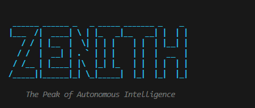

# 🏔️ ZENITH AI CLI
### *The Peak of Terminal Productivity & Autonomous Engineering*

[](https://opensource.org/licenses/MIT)
[](https://www.python.org/downloads/)
[](https://ollama.ai/)
[](https://ai.google.dev/)

**ZENITH** is a high-performance, autonomous AI agent designed to live in your terminal. It acts as a **Staff Engineer**, providing deep architectural insights, secure code refactoring, and project-wide analysis with a local-first philosophy.

---

## 📺 Preview


---

## ✨ Core Pillars

### 🧠 Nexus Graph Memory
Unlike standard chat bots, Zenith builds a **Knowledge Graph** of your project. It identifies entities (files, classes, modules) and their relationships, allowing it to understand the "Why" behind your code, not just the "What".

### 🛡️ Secure Auto-Refactoring
Let Zenith handle the heavy lifting. Using a secure path-sanitization engine, Zenith proposes code changes, shows you a **Unified Diff**, and waits for your confirmation before touching a single line of code.

### 🔌 Hybrid Intelligence
Choose your engine:
- **Local (Ollama)**: 100% private, zero latency, runs offline.
- **Cloud (Gemini 1.5)**: Ultra-high context for massive project analysis and complex reasoning.

### 🎭 Specialized Personas
Switch focus on the fly:
- `architect`: Patterns, scalability, and system design.
- `security`: Vulnerability scanning and secure defaults.
- `reviewer`: Clean code, naming conventions, and best practices.
- `staff`: Pragmatic, results-oriented technical leadership.

---

## 🚀 Quick Start

### 1. Installation
**Windows (PowerShell):**
```powershell
./install.ps1
```
**macOS / Linux:**
```bash
chmod +x install.sh && ./install.sh
```

### 2. Ignite the Nexus
Scan your project and teach Zenith your architecture:
```bash
zenith ignite
```

### 3. Interactive Mode
Simply run `zenith` to enter the **Interactive Dashboard**.

---

## 🛠️ Advanced Usage

| Command | Action |
| :--- | :--- |
| `zenith ask "..." -f src/` | Query with recursive directory context. |
| `zenith refactor <file> "..."` | Automated code improvement with diff preview. |
| `zenith nexus` | Visualize learned insights and relationships. |
| `zenith guide` | Detailed in-terminal documentation. |

---

## ⚙️ Configuration
Customize your experience in `.env`:
```env
AI_PROVIDER=ollama   # or 'gemini'
MODEL_NAME=zenith    # Ollama model name
GEMINI_API_KEY=...    # Required for cloud mode
```

---

## 🗺️ Roadmap & Progress
- [x] **Nexus Graph**: Entity-relationship project mapping.
- [x] **Recursive Context**: Automatic project-wide awareness.
- [x] **Hybrid Engine**: Seamless switching between Local and Cloud.
- [x] **Interactive Dashboard**: Professional terminal UI/UX.
- [ ] **Vector Search**: Deep semantic search across large codebases.
- [ ] **Multi-file Refactor**: Orchestrating changes across multiple modules.

---

## 🤝 Contributing
Join us in reaching the peak! Check out [CONTRIBUTING.md](CONTRIBUTING.md).

---
**Reach your peak. ZENITH.**
