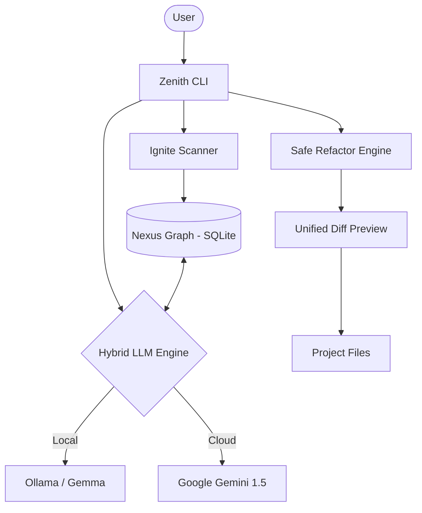

# 🏔️ ZENITH AI CLI
### *The Peak of Terminal Productivity & Autonomous Engineering*

[](https://opensource.org/licenses/MIT)
[](https://www.python.org/downloads/)
[](https://ollama.ai/)
[](https://ai.google.dev/)
[](https://github.com/sponsors/a921-h)

[Leer en Español 🇪🇸](README.es.md)

**ZENITH** is a high-performance, autonomous AI agent designed to live in your terminal. It acts as a **Staff Engineer**, providing deep architectural insights, secure code refactoring, and project-wide analysis with a local-first philosophy.

---

## 📺 Preview


---

## 🛠️ System Requirements

To run ZENITH at peak performance, ensure you meet the following:

- **Python**: 3.10 or higher.
- **Ollama**: 0.1.x (Required for local-first intelligence).
- **OS**: Windows (PowerShell), macOS, or Linux.
- **RAM**: 8GB+ (16GB recommended for running larger local models).

---

## ✨ Core Pillars

### 🧠 Nexus Graph Memory
Unlike standard chat bots, Zenith builds a **Knowledge Graph** of your project. It identifies entities (files, classes, modules) and their relationships, allowing it to understand the "Why" behind your code, not just the "What".

### 🛡️ Secure Auto-Refactoring
Let Zenith handle the heavy lifting. Using a secure path-sanitization engine, Zenith proposes code changes, shows you a **Unified Diff**, and waits for your confirmation before touching a single line of code.

### 🔌 Hybrid Intelligence
Choose your engine:
- **Local (Ollama)**: 100% private, zero latency, runs offline.
- **Cloud (Gemini 1.5)**: Ultra-high context for massive project analysis and complex reasoning.

---

## 🏗️ Architecture

Zenith uses a unique **Nexus Graph** system to maintain project awareness without saturating the LLM context.



---

## ⚔️ Why Zenith?

| Feature | Zenith AI | Aider | Cursor |
| :--- | :--- | :--- | :--- |
| **Philosophy** | Local-First / Hybrid | CLI-First | IDE-Integrated |
| **Memory** | **Nexus Graph** (Logic aware) | Vector Embeddings | Vector Embeddings |
| **Privacy** | 100% Private (Ollama) | Cloud Dependent | Cloud Dependent |
| **Context** | Project-wide Knowledge | File-based context | File-based context |
| **Tooling** | Built-in Terminal UI | Command Line | Full IDE |

---

## 🚀 Quick Start

### 1. Installation
**Windows (PowerShell):**
```powershell
./install.ps1
```
**macOS / Linux:**
```bash
chmod +x install.sh && ./install.sh
```

### 2. Ignite the Nexus
Scan your project and teach Zenith your architecture:
```bash
zenith ignite
```

### 3. Interactive Mode
Simply run `zenith` to enter the **Interactive Dashboard**.

---

## ⚙️ Configuration
Customize your experience in `.env`:
```env
AI_PROVIDER=ollama   # or 'gemini'
MODEL_NAME=zenith    # Ollama model name
GEMINI_API_KEY=...    # Required for cloud mode
```

---

## 🗺️ Roadmap & Progress
- [x] **Nexus Graph**: Entity-relationship project mapping.
- [x] **Recursive Context**: Automatic project-wide awareness.
- [x] **Hybrid Engine**: Seamless switching between Local and Cloud.
- [x] **Interactive Dashboard**: Professional terminal UI/UX.
- [ ] **Vector Search**: Deep semantic search across large codebases.
- [ ] **Multi-file Refactor**: Orchestrating changes across multiple modules.

---

## 💰 Support & Sponsorship
If ZENITH has saved you hours of work, please consider supporting its development:
- **[Donate via Stripe](https://donate.stripe.com/aFa4gr8a43LReAx0p7bbG03)**
- [GitHub Sponsors](https://github.com/sponsors/a921-h)
- [View detailed Sponsors Page](SPONSORS.md)
- Feedback and Bug Reports.

---

## 🤝 Contributing
Join us in reaching the peak! Check out [CONTRIBUTING.md](CONTRIBUTING.md).

---
**Reach your peak. ZENITH.**
