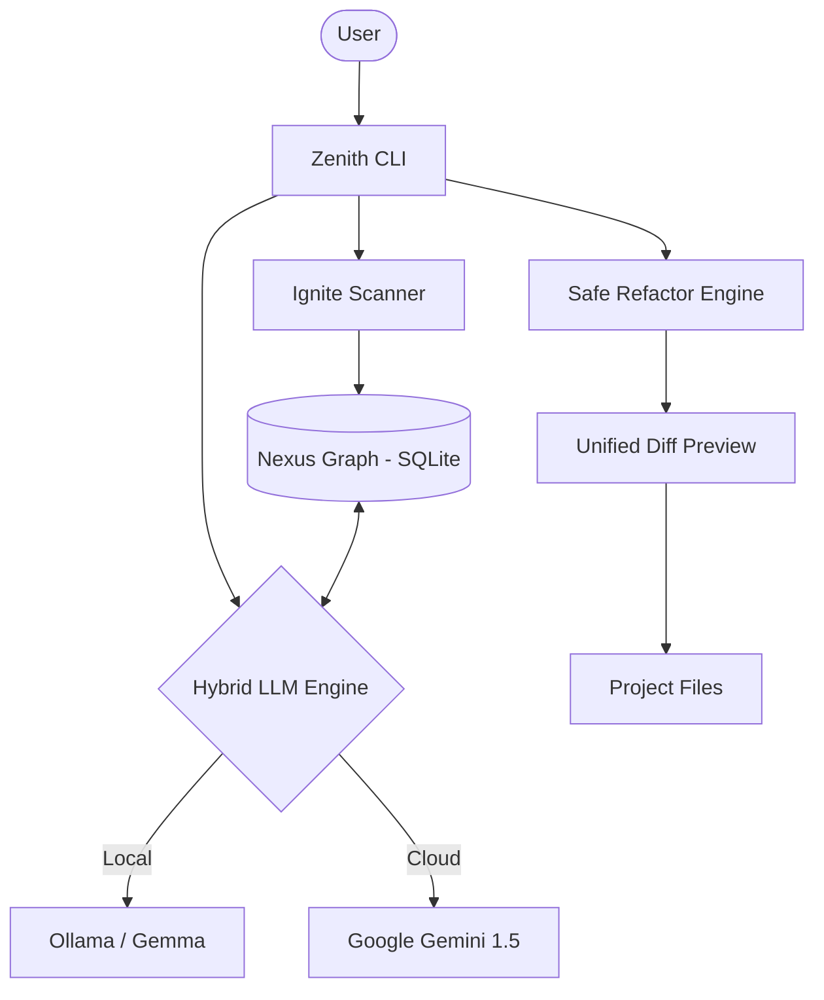

# Zenith Architecture: The Nexus Graph

Zenith is not just a chatbot wrapped in a CLI. It is an autonomous agent built on the foundation of the **Nexus Graph**, a logic-aware memory system that mimics how a Staff Engineer understands a codebase.

## The Core Philosophy
Standard LLM tools rely heavily on Vector Embeddings (RAG) to find relevant code. While effective for semantic search, vector databases lack an understanding of *logic* and *relationships* (e.g., "Class A inherits from Class B", or "Module X depends on API Y").

Zenith solves this by constructing a deterministic **Knowledge Graph** (stored locally in SQLite) alongside the traditional context window.

## System Components

### 1. Ignite Scanner (`zenith ignite`)
When you run `zenith ignite`, Zenith recursively scans your project directory. 
- It identifies entities (Functions, Classes, Configuration files).
- It extracts relationships and dependencies.
- It saves these into the local `zenith_memory.sqlite` database.

### 2. The Hybrid Engine
Zenith is designed to be engine-agnostic, providing the best of both worlds:
- **Local (Ollama)**: Uses models like `gemma` or `llama3`. It provides zero latency, 100% privacy, and offline capabilities. Perfect for secure environments and quick refactors.
- **Cloud (Gemini 1.5)**: When you need to process massive codebases or require complex, multi-step reasoning, Zenith seamlessly switches to Gemini to leverage its massive context window.

### 3. Path Sanitization & Safe Refactoring
Autonomy requires safety. Zenith's internal architecture includes a strict `path_sanitizer`.
Before any file operation (read/write/delete), Zenith:
1. Resolves the absolute path.
2. Ensures the target path is strictly within the current working directory.
3. Prevents Directory Traversal attacks (`../../etc/passwd`).

When refactoring, Zenith generates a **Unified Diff** and requires explicit user confirmation before applying changes.

## Architecture Diagram

## Future Roadmap
- Integration of a local Vector Database (ChromaDB) to combine semantic search with the Nexus Graph.
- Multi-file coordinated refactoring orchestration.
